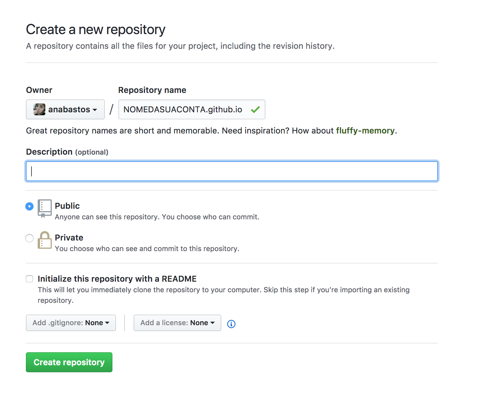
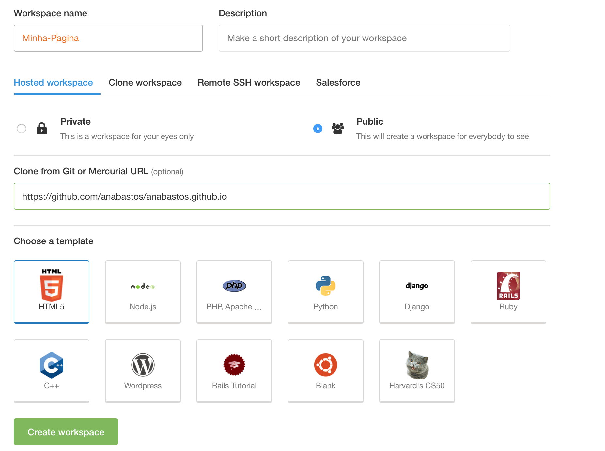
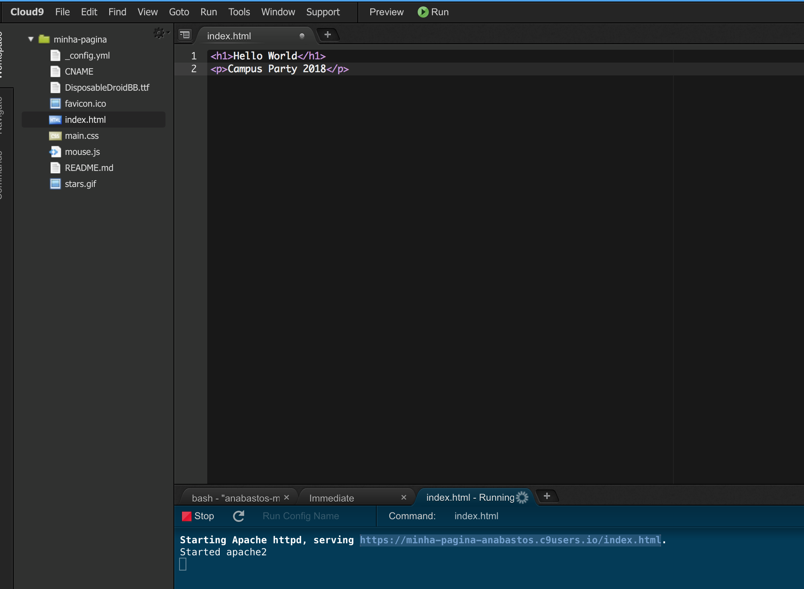

## Passo 1

## Desenvolvimento Web

Nesse workshop vamos aprender o básico de duas linguagens voltadas para o desenvolvimento web: HTML e CSS. 

Ao digitarmos um endereço no navegador, ele receberá o arquivo HTML do servidor web que irá renderizar o conteúdo. Esse arquivo vai pedir para o navegador verificar também os arquivos CSS e Javascript. Cada uma dessas linguagens tem uma função diferente no nosso site e juntos determinam como ele vai ser estruturado (através do HTML), visualizado (através do CSS) e como será o seu funcionamento (por meio do JavaScript).

* [The odin project](https://www.theodinproject.com/courses/web-development-101)

#### Ferramentas do dia-a-dia

* Computador
* Google
* Editor de texto
* Terminal
* Stack Overflow
* Git / Github

#### O que vamos criar

Iremos colocar no ar uma página pessoal responsiva, isto é, que esteja adaptada para ser exibida em celulares, tablets, computadores e outros tipos de dispositivos. Seu site poderá servir como:
* Currículo pessoal
* Portfólio de trabalho
* Meio de redirecionar pessoas para as suas redes sociais.

## Conta no Github

Git é um sistema de controle de versionamento de projetos e é uma ferramenta essencial para desenvolvedores. Com ele podemos criar versões de um arquivo com cada modificação salvando todas as diferenças entre os arquivos e pastas e ainda mantendo um histórico de tudo que foi modificado em cada versão.

O Git permite que você revise e escale seu projeto sem precisar ficar restaurando os estados de arquivo passados, além de ajudar muito quando estamos trabalhando em grupo. Ao estar conectado na internet, você pode colocar seu projeto no Github que é um site que serve para compartilhar códigos com outros desenvolvedores.

Enquanto o Git funciona na sua máquina local, o Github é como se fosse um repositório remoto na web para todos os projetos de código. Dessa forma, aprendendo Git fica muito mais fácil mostrar o seu portfólio pelo Github :)

Primeiramente, crie uma conta no Github aqui: [https://github.com/join](https://github.com/join).

O propósito do Github é lidar com o projeto, que é um conjunto de diversos arquivos que serão modificados através do seu desenvolvimento. O Github salva toda a estrutura de dados em um "repósitorio", que é o nosso ambiente de trabalho.

Após a criação da sua conta, crie um repositório pelo [https://github.com/new](https://github.com/new) com o nome **NOMEDASUACONTA.github.io**, substituindo **NOMEDASUACONTA** pelo nome da conta que você acabou de criar. 

 *Nota 1: O nome do repositório precisa ser necessariamente nesse formato!*
 *Nota 2: lembre-se que as contas gratuitas do GitHub se destinam a projetos OpenSource e por isso os seus repositórios estarão abertos a qualquer interessado.*



Copie o link do repositório que acabou de ser criado (algo como `https://github.com/NOMEDASUACONTA/NOMEDASUACONTA.github.io`). Ele vai ser usado mais tarde para você criar o seu ambiente de desenvolvimento.

## Ambiente no C9

Se logue pelo icone do Github no [Cloud9](https://c9.io/).

Clique em "Create Workspace". Dessa forma o Cloud9 vai criar um ambiente de desenvolvimento online para você :)
Preencha o formulário com o nome da workspace: "Minha Página"
E na opção "Clone from Git or Mercurial URL (optional)" coloque o link do repositório que você criou.



Se reclamar de não ter e-mail registrado, vá para o [dashboard](https://codeanywhere.com/dashboard) e clique em **Resend Verification Email**. Nesse caso você precisa verificar o seu e-mail cadastrado no github.

Clique em **File/New File** e uma nova aba vai abrir no editor.
Tecle **Crtl + S** ou então clique em **File/Save as...**, mude o filename para **index.html** e clique no botão verde de **save**.

Com o index.html aberto, escreva:
```html
<h1>Hello World</h1>
<p>JS Ladies RJ</p>
```

Nesse exemplo estamos colocando o `Hello World` dentro da tag de `h1`, que signfica que ele será um título e o `JS Ladies RJ` dentro da tag `p`, simbolizando que ele é um paragrafo.

Clique no botão verde de **run**. Logo abaixo no terminal vai aparecer um link.
Ao entrar nesse link você pode ver o resultado do seu HTML.



Mas suas modificações ainda não estão no ar no [https://NOMEDASUACONTA.github.io](https://NOMEDASUACONTA.github.io), pois ainda precisamos publicá-las!
No próximo cápitulo vamos abordar mais sobre HTML e faremos o nosso primeiro commit no Git, que vai publicar nossas modificações na web.

## Sem o ambiente

Não tem problema se você não quiser usar o ambiente do C9. Pra isso basta instalar e configurar o seu Git em seu terminal. Veja aqui como [instalar](https://git-scm.com/book/en/v2/Getting-Started-Installing-Git).

Para configurar basta configurar com os seguintes comandos:
```bash
git config --global 
```

E em seguida navegue no terminal e clone o projeto criado no Github na sua pasta de preferência:
```bash
# cria pasta NOMEDASUACONTA.github.io
git clone `https://github.com/NOMEDASUACONTA/NOMEDASUACONTA.github.io`

# acessa a pasta NOMEDASUACONTA.github.io
cd NOMEDASUACONTA.github.io
```

Agora já é possivel mexer com o Github por meio do seu proprio terminal!

Crie dentro da sua pasta do projeto um arquivo chamado **index.html** com o conteúdo:
```html
<h1>Hello World</h1>
<p>JS Ladies RJ</p>
```

Para verificar suas modificações no navegador, é necessário um webserver. Pra isso [instale o Node.js aqui](https://nodejs.org/en/download/).
Após a instalação digite no terminal:
`npm install http-server -g`

O NPM pode funcionar como um gerenciador de pacotes e, no caso desse comando, instalamos globalmente o pacote `http-server`.

Para usá-lo na pasta do seu projeto (NOMEDASUACONTA.github.io), basta escrever o comando no terminal:
```bash
http-server 8080
```

Com isso você pode acessar a url `http://localhost:8080` e ver o seu website rodando na sua máquina :)

#### [Ir para o passo 2](chapter2.md)