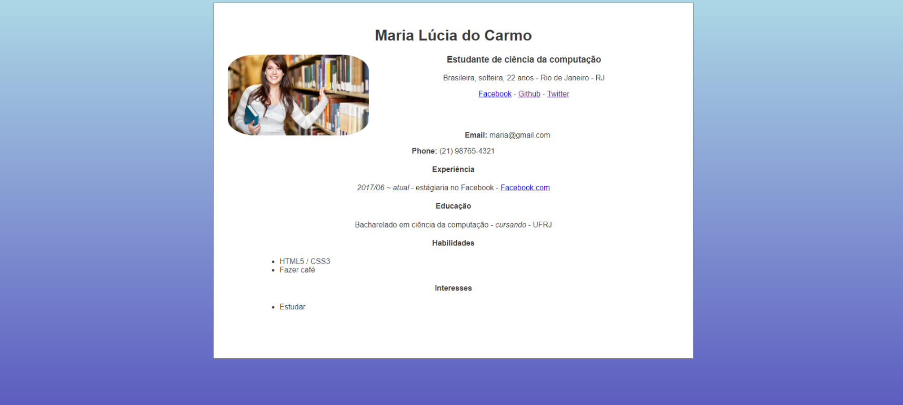

## Passo 3

## Estilizando com CSS

## O que é CSS

**CSS** vem de **Cascading Style Sheets**, que é uma linguagem de folhas de estilos. Ela é que irá tornar sua página apresentável na web, modificando a aparência dos elementos HTML.

## Estilizando o HTML

Clique em **File/New File** e uma nova aba vai abrir no editor.
Tecle **ctrl + S** ou então clique em **File/Save as...** e mude o Filename para **style.css** e clique no botão verde de **Save**.

No style.css cole:

```css
body {
    background-color: red;
    font-family: "Gill Sans Extrabold", sans-serif;
}
```

O que isso quer dizer? Tudo dentro da nossa tag `<body>` terá uma cor de fundo vermelha. A cor de fundo pode ser uma cor em inglês, em hexadecimal e até mesmo uma imagem. E a fonte do texto inserido na tag `<body>` será *Gill Sans Extrabold*.

O `body` é o nosso **seletor**, o que está entre chaves é a **declaração** do estilo e nele temos as **propriedades** com os seus respectivos **valores**.

Agora, é necessário importar esse arquivo CSS dentro do nosso HTML para que os estilos funcionem. Pra isso, no nosso HTML, dentro da tag `<head>`, cole esta linha:

`<link rel="stylesheet" type="text/css" href="style.css">`

```html
<head>
    <title>Minha página</title>
    <link rel="stylesheet" type="text/css" href="style.css">
</head>
```

Clique no botão verde de **Run**. Logo abaixo no terminal e ao entrar no link verifique se o fundo está de fato vermelho.


### Mais CSS

#### Fontes e cores

Como já dito mais acima, as cores podem estar em inglês ou em hexadecimal. Se caso quiser saber os nomes ou os seus respectivos códigos hexadecimais, você pode consultar estes links:

- [https://www.w3schools.com/colors/colors_names.asp](https://www.w3schools.com/colors/colors_names.asp)
- [https://www.w3schools.com/colors/colors_picker.asp](https://www.w3schools.com/colors/colors_picker.asp)

Anteriormente definimos o background como red, mas podemos também usar o seu valor hexadecimal **#FF0000**:

```css
body {
  background-color: #FF0000;
}
```

Para modificar as características de todos os parágrafos, podemos usar diversas propriedades:

```css
p {
  font-size: 20px;
  color: darkgray;
  font-family: Arial;
  font-style: bold;
  text-align: center;
  line-height: 2;
  letter-spacing: 1px;
  text-align: center;
  text-shadow: 3px 3px 1px black;
}
```

- **font-size** é o tamanho da fonte. Pode estar em pixels, como no exemplo acima.
- **color** é a cor do texto.
- **font-family** é a fonte do texto.
- **font-style** define propriedades como negrito ou itálico.
- **line-height** define a altura da letra.
- **letter-spacing** define o espaçamento entre as letras.
- **text-align** define o alinhamento do texto.
- **text-shadow** é a sombra do texto. Nele podemos definir a direção da sombra (tanto na horizontal quanto na vertical), o seu tamanho e cor.

Lembre-se que você não precisa usar todas essas propriedades!


#### Selecionando elementos HTML

Para não selecionarmos sempre tags para estilizar, podemos optar por selecionar as classes dos elementos HTML. Sempre que você tiver elementos que merecerem ser agrupados de alguma forma, você pode usar uma classe para indicar que todos eles tem algo em comum.

No CSS colocamos um ponto antes do nome da classe para definir os estilos inerentes a ela.

No seu HTML, adicionamos classes assim:

```html
<h4 class="titulo">
  Título
</h4>

```

No arquivo CSS, estilizamos por classes assim:

```css
.titulo {
  font-size: 30px;
}

.logo {
  width: 300px;
}
```

No exemplo, criamos as classes `titulo` pra uma tag `<h4>` e `logo` para uma tag ``. Isso permite que possamos estilizar esses elementos específicos. Todo elemento que tiver uma classe **titulo** terá tamanho de fonte 30px e todo elemento que tiver uma classe **logo** terá tamanho de 300px.

É importante usar classes pois podemos também reutilizar estilos e definir o que cada coisa é. Lembrando que cada elemento pode ter mais de uma classe.

#### Fundo

Com imagem:
```css
body {
  background-image: url("https://avatars1.githubusercontent.com/u/28883362?s=200&v=4");
  background-repeat: no-repeat;
  background-color: #cccccc;
}
```

Gradiente:
```css
body {
  background-color: #cccccc;  
  background-image: linear-gradient(red, yellow);
}
```

#### Tamanho

Uma coisa que você vai notar sobre escrever CSS é que um bocado disso é sobre caixas. Muitos dos elementos HTML da sua página podem ser pensados como caixas.

Como esperado, o layout CSS é baseado principalmente no modelo de caixas. Cada um dos blocos que ocupam espaço na sua página tem propriedades como essas:


- **margin**: é o espaçamento externo, referente à margem de um elemento.
- **padding**: é o espaçamento interno;
- **border**: é a linha que contorna o elemento.

Para isso vamos criar uma caixa com algum texto:

```html
<div class="box">
  <p>JSLadies RJ</p>
</div>
```

Se pintarmos a caixinha de azul, podemos ver mais claramente:

```css
.box {
  background-color: blue;
}
```

Resultado:

<div style="background-color: blue;" class="box">
  <p>JSLadies RJ</p>
</div>

O padding no css representa o espaçamento que está ao redor do conteúdo dentro da borda, então se aumentarmos o padding para 10px ficará visível o espaço que até então estava zerado.

```css
.box {
  background-color: blue;
  padding: 10px;
}
```

Resultado:

<div style="background-color: blue; padding: 10px;" class="box">
  <p>JSLadies RJ</p>
</div>

Podemos ajustar o tamanho da altura e largura da caixinha também:

```css
.box {
  background-color: gray;
  padding: 10px;
  height: 80px;
  width: 100px;
}
```

Mudando pra cinza, temos um resultado bem legal:

<div style="background-color: gray;padding: 10px;height: 80px;width: 100px;" class="box">
  <p>JSLadies RJ</p>
</div>


#### Deixando redondo

Para arredondar as bordas dos objetos usamos a propriedade `border-radius`:

```css
.avatar {
  border-radius: 50%;
}
```

Supondo que temos um avatar de cachorro:

```html

```

A medida é em porcentagem de arredondamento e 50% equivale a um círculo, tendo este resultado:


#### Centralizando uma imagem

```css
img {
  border-radius: 50%;
  display: block;
  margin: 0 auto;
}
```

Para aplicar margens a uma imagem, nós temos que dar a ela um comportamento de bloco usando `display: block;`, resultando em:


#### Estilizando Bordas

Como já vimos, todo elemento tem padding, border e margin. Então podemos estilizar suas bordas. Ela receberá 3 valores: tamanho, estilo e cor:

```css
img {
  border-radius: 50%;
  display: block;
  margin: 0 auto;
  border: 2px solid black;
}
```
No exemplo, criamos uma borda de 2px, sólida e de cor preta, resultando em:


#### Posicionamento

A propriedade de float é usada para posicionamento no layout:

```css
.avatar {
  float: left;
}
```

Seus valores significam:
- **left** - O elemento flutua para a esquerda do seu container;;
- **right**- O elemento flutua para a direita do seu container
- **none** - O elemento não flutua;
- **inherit** - O elemento herda o float de seu elemento pai.


#### Exemplo



Adicionando alguns estilos e classes no HTML anterior podemos chegar nesse resultado sem muitas linhas de código.
Usamos o *background-image* para criar um fundo gradiente e encapsulamos a biografia dentro de uma `<div>` com a classe `.bio`.

Nele, criamos uma caixinha de com 50% de largura e 90% de altura, pintamos o fundo de branco, alinhamos o texto para o centro e adicionamos uma borda sólida e deixamos um padding de 30px na caixinha.

O avatar ficou com a classe `.avatar` e teve sua largura alterada para 300px, adicionamos uma leve borda circular e flutuamos a imagem pra esquerda.

Criamos uma classe `.center` com as propriedades que centralizam blocos, assim, tudo que tiver a classe `center` estará centralizado.

```css
body {
  background-color: lightblue;
  background-image: linear-gradient(lightblue, rgb(93, 93, 192));
  font-family: "Gill Sans Extrabold", sans-serif;
  color: #383838;
}

.avatar {
  width: 300px;
  border-radius: 20%;
  float: left;
}

.bio {
  height: 90%;
  text-align: center;
  background: white;
  width: 50%;
  padding: 30px;
  border: 1px solid gray;
}

.center {
  display: block;
  margin: 0 auto;
}

.content {
  margin: 70px;
}
```

Adicionando suas respectivas classes no HTML:

```html
<!DOCTYPE html>
<html>
<head>
    <title>Minha página</title>
    <link rel="stylesheet" type="text/css" href="main.css">
</head>
<body>
    <div class="bio center">
      <h1>Maria Lúcia do Carmo</h1>
      
      
      <h2>Estudante de ciência da computação</h3>
      <p>Brasileira, solteira, 22 anos - São Paulo - SP<p>
      <a href="http://fb.com">Facebook</a> - <a href="http://github.com">Github</a> - <a href="http://twitter.com">Twitter</a>

      <div class="content">
        <p><b>Email:</b> maria@gmail.com</p>
        <p><b>Phone:</b> (+55)11-986993010</p>

        <h3>Experiência</h3>
        <p><i>2017/06 ~ Atual</i> - Estágiaria no Facebook - <a href="http://fb.com">Facebook.com</a></p>

        <h3>Educação</h3>
        <p>Bacharelado em ciencia da computação (<i>cursando</i>) - USP</p>

        <h3>Habilidades</h3>
        <ul>
          <li>HTML5 / CSS3</li>
          <li>Fazer café</li>
        </ul>

        <h3>Interesses<h3>
        <ul>
          <li>Jogar LoLzinho <i>(Sou platina)</i></li>
        </ul>
      </div>
    </div>
</body>
</html>

```

## Seu segundo commit

Repita o mesmo procedimento anterior:
```bash
# Verifique status do repositório
git status
# Adiciona todos os arquivos modificados p/ staging
git add *
# Ou individualmente
git add style.css
git add index.html
# Faz commit
git commit -m "Adicionando estilos"
# Adiciona modificações
git push
```

Escrever o que foi desenvolvido para cada commit é muito importante pois isso pode te guiar e também ajudar outras pessoas que estiverem trabalhando no mesmo projeto, ao verificar o que foi desenvolvido anteriormente.

#### [Ir para o passo 4](chapter4.md)
