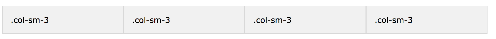

## Passo 4

## Importando Bootstrap

#### Bootstrap

Bootstrap é a biblioteca mais popular de HTML, CSS e JS para o desenvolvimento de sites responsivos e é completamente grátis.

Para usá-la no seu projeto, basta entrar na [página de downloads do bootstrap](https://getbootstrap.com/docs/4.0/getting-started/download/), copiar o conteúdo do **Bootstrap CDN** e colar dentro da tag `<head>` do seu HTML. Sua tag `<head>` ficará assim:

```html
<head>
  <title>Minha página</title>
  <link rel="stylesheet" href="https://stackpath.bootstrapcdn.com/bootstrap/4.1.3/css/bootstrap.min.css" integrity="sha384-MCw98/SFnGE8fJT3GXwEOngsV7Zt27NXFoaoApmYm81iuXoPkFOJwJ8ERdknLPMO" crossorigin="anonymous">
  <script src="https://stackpath.bootstrapcdn.com/bootstrap/4.1.3/js/bootstrap.min.js" integrity="sha384-ChfqqxuZUCnJSK3+MXmPNIyE6ZbWh2IMqE241rYiqJxyMiZ6OW/JmZQ5stwEULTy" crossorigin="anonymous"></script>
  <link rel="stylesheet" type="text/css" href="main.css">
</head>
```

Podemos também baixar o Bootstrap no nosso projeto e importá-lo no nosso HTML especificando o caminho dele, assim como fizemos no `style.css`.

#### Adicionando componentes

O Bootstrap oferece uma infinidade de componentes que podem ser usados em qualquer projeto. Se quiser dar uma olhada, é só acessar [este link](https://getbootstrap.com/docs/4.0/components/).

#### Sistema de grids

O Bootstrap nos permite usar um sistema de grids, isto é, um sistema que permite alinhar o conteúdo disponível em colunas.

Coloque este código no `<body>` do seu HTML:

```html
<div class="container">
  <div class="row">
    <div class="col-sm">
      Primeira Coluna
    </div>
    <div class="col-sm">
      Segunda Coluna
    </div>
    <div class="col-sm">
      Terceira Coluna
    </div>
  </div>
</div>
```

## Importando FontAwesome

O FontAwesome é uma ferramenta que oferece uma grande variedade de ícones escaláveis e customizáveis.

Vá em ["Get Started"](http://fontawesome.io/get-started/) no site oficial do FontAwesome. Nele você precisará colocar o seu e-mail para receber o link que será colocado no `<head>`.

#### Ícones em colunas 

Importe o FontAwesome no seu arquivo HTML (veja a penúltima linha deste código):

```html
<head>
  <title>Minha página</title>
  <link rel="stylesheet" href="https://stackpath.bootstrapcdn.com/bootstrap/4.1.3/css/bootstrap.min.css" integrity="sha384-MCw98/SFnGE8fJT3GXwEOngsV7Zt27NXFoaoApmYm81iuXoPkFOJwJ8ERdknLPMO" crossorigin="anonymous">
  <script src="https://stackpath.bootstrapcdn.com/bootstrap/4.1.3/js/bootstrap.min.js" integrity="sha384-ChfqqxuZUCnJSK3+MXmPNIyE6ZbWh2IMqE241rYiqJxyMiZ6OW/JmZQ5stwEULTy" crossorigin="anonymous"></script>
  <link rel="stylesheet" type="text/css" href="main.css">
  <script src="link_do_font_awesome_que_vc_receberá_por_email"></script>
</head>
```

Após importar, cole dentro da tag `<body>` o seguinte código:

```html
<i class="fa fa-facebook-official" aria-hidden="true"></i>
```

Perceba que irá aparecer na sua página um ícone do Facebook!

Podemos aumentar ou diminuir esse ícone adicinando mais classes:

```html
<i class="fa fa-facebook-official fa-2x" aria-hidden="true"></i>
```

Podemos também colocar ícones em listas, rotacioná-los e até animá-los de acordo com os [exemplos do FontAwesome](http://fontawesome.io/examples/).

Para tornar esse ícone linkável basta colocá-lo dentro da tag `<a>`:

```html
<a href="https://www.facebook.com/" target="_blank">
  <i class="fa fa-facebook-official" aria-hidden="true"></i>
</a>
```

#### Ícones responsivos

Para tornar os ícones do FontAwesome responsivos com o Bootstrap, vamos misturar o sistema de grids com os ícones linkáveis. Para isso vamos colocar os ícones como conteúdo das colunas:

```html
<div class="container">
  <div class="row">
    <div class="col-xs-6 col-sm-3">
      <a href="https://www.facebook.com/" target="_blank">
        <i class="fa fa-facebook-official fa-3x" aria-hidden="true"></i>
      </a>
    </div>
    <div class="col-xs-6 col-sm-3">
        <a href="https://www.google.com/" target="_blank">
          <i class="fa fa-google fa-3x" aria-hidden="true"></i>
        </a>
    </div>
    <div class="col-xs-6 col-sm-3">
      <a href="https://www.twitter.com/" target="_blank">
        <i class="fa fa-twitter fa-3x" aria-hidden="true"></i>
      </a>
    </div>
    <div class="col-xs-6 col-sm-3">
      <a href="https://www.github.com/" target="_blank">
        <i class="fa fa-github fa-3x" aria-hidden="true"></i>
      </a>
    </div>
  </div>
</div>
```

A classe `col-sm` significa quanto de espaçamento do grid esse elemento vai ter quando estiver em telas de tamanho tablet para cima. Isso significa que se ele vai ter um espaçamento de 3, conseguindo ter espaço para ficar alinhados já que o grid total é 12. O alinhamento da coluna ficará assim:



Já a classe `col-xs` servirá para quando estivermos em telas de tamanho mobile. Portanto os 4 ícones vão ter um espaçamento como nas imagens do dobro do tamanho, por ter 6 de espaçamento quebramos os ícones em duas colunas, sendo mais visual em telas mobile:


Usamos a classe `fa-3x` pois ela indicará que o ícone irá aumentar em 3x com relação ao seu tamanho original.

Para alterar a cor do ícone, basta selecionar a própria classe do ícone e estilizá-la no seu arquivo CSS:

```css
.fa {
  color: gray;
}
```

Assim temos o seguinte resultado (primeira imagem para desktop e segunda para mobile):


## Terceiro commit

Você pode usar o comando Git Log para verificar os seus commits até agora:
```bash
# Logs
git log
```

Faça novamente os seguintes passos:
```bash
# Verifique status do repositório.
git status
# Adicione arquivos p/ staging
git add *
# Faz commit
git commit -m "Importando Bootstrap e FontAwesome"
# Adiciona modificações
git push
```

Agora se você acessar o link [https://NOMEDASUACONTA.github.io](https://NOMEDASUACONTA.github.io), você irá conseguir ver o conteúdo do seu site.
Demora alguns minutinhos para as mudanças realmente irem ao ar ;)

#### [Ir para conteúdos de estudo](final.md)
