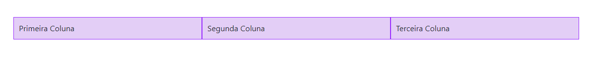

## Passo 4

## Importando Bootstrap

#### Bootstrap

Bootstrap é a biblioteca mais popular de HTML, CSS e JS para o desenvolvimento de sites responsivos e é completamente grátis.

Para usá-la no seu projeto, basta entrar na [página de downloads do bootstrap](https://getbootstrap.com/docs/4.0/getting-started/download/), copiar o conteúdo do **Bootstrap CDN** e colar dentro da tag `<head>` do seu HTML. Sua tag `<head>` ficará assim:

```html
<head>
  <title>Minha página</title>
  <link rel="stylesheet" href="https://stackpath.bootstrapcdn.com/bootstrap/4.1.3/css/bootstrap.min.css" integrity="sha384-MCw98/SFnGE8fJT3GXwEOngsV7Zt27NXFoaoApmYm81iuXoPkFOJwJ8ERdknLPMO" crossorigin="anonymous">
  <script src="https://stackpath.bootstrapcdn.com/bootstrap/4.1.3/js/bootstrap.min.js" integrity="sha384-ChfqqxuZUCnJSK3+MXmPNIyE6ZbWh2IMqE241rYiqJxyMiZ6OW/JmZQ5stwEULTy" crossorigin="anonymous"></script>
  <link rel="stylesheet" type="text/css" href="main.css">
</head>
```

Podemos também baixar o Bootstrap no nosso projeto e importá-lo no nosso HTML especificando o caminho dele, assim como fizemos no `style.css`.

#### Adicionando componentes

O Bootstrap oferece uma infinidade de componentes que podem ser usados em qualquer projeto. Se quiser dar uma olhada, é só acessar [este link](http://getbootstrap.com/docs/4.1/components/).

#### Sistema de grids

O Bootstrap nos permite usar um sistema de grids, isto é, um sistema que permite alinhar o conteúdo disponível em colunas. Você pode ver no exemplo abaixo:

```html
<div class="container">
  <div class="row">
    <div class="col-sm">
      Primeira coluna
    </div>
    <div class="col-sm">
      Segunda coluna
    </div>
    <div class="col-sm">
      Terceira coluna
    </div>
  </div>
</div>
```



## Importando Font Awesome

O FontAwesome é uma ferramenta que oferece uma grande variedade de ícones escaláveis e customizáveis.

Vá em ["how to use"](https://fontawesome.com/how-to-use) no site oficial do Font Awesome. Na seção "Use Font Awesome's Free CDN
" e copie a tag `<link>` disponibilizada. Em seguida, vá no seu arquivo `index.html` e cole dentro da tag `<head>`:

```html
<head>
  <title>Minha página</title>
  <link rel="stylesheet" href="https://stackpath.bootstrapcdn.com/bootstrap/4.1.3/css/bootstrap.min.css" integrity="sha384-MCw98/SFnGE8fJT3GXwEOngsV7Zt27NXFoaoApmYm81iuXoPkFOJwJ8ERdknLPMO" crossorigin="anonymous">
  <script src="https://stackpath.bootstrapcdn.com/bootstrap/4.1.3/js/bootstrap.min.js" integrity="sha384-ChfqqxuZUCnJSK3+MXmPNIyE6ZbWh2IMqE241rYiqJxyMiZ6OW/JmZQ5stwEULTy" crossorigin="anonymous"></script>
  <link rel="stylesheet" type="text/css" href="main.css">
  <link rel="stylesheet" href="https://use.fontawesome.com/releases/v5.3.1/css/all.css" integrity="sha384-mzrmE5qonljUremFsqc01SB46JvROS7bZs3IO2EmfFsd15uHvIt+Y8vEf7N7fWAU" crossorigin="anonymous">
</head>
```

Pronto! Agora você poderá usar qualquer ícone do Font Awesome.

No exemplo abaixo, criamos uma tag `<i>` que receberá as classes do Font Awesome, renderizando o ícone do Facebook:

```html
<i class="fab fa-facebook"></i>
```


Se quisermos aumentar ou diminuir os ícones, podemos fazer isso colocando mais uma classe. No exemplo abaixo, o ícone terá o seu tamanho duplicado:

```html
<i class="fab fa-facebook fa-2x"></i>
```

Podemos também colocar ícones em listas, rotacioná-los e até animá-los de acordo com os [exemplos do Font Awesome](https://fontawesome.com/how-to-use/on-the-web/styling/).

Para tornar esse ícone linkável, podemos colocá-lo dentro da tag `<a>`:

```html
<a href="https://www.facebook.com/" target="_blank">
  <i class="fab fa-facebook"></i>
</a>
```

Obs: o atributo `target` da tag `<a>` indica como que a url indicada será aberta. Nesse caso, o valor `_blank` irá fazer com que o Facebook seja aberto em uma nova aba do seu navegador.

#### Ícones responsivos

Para tornar os ícones do Font Awesome responsivos com o Bootstrap, vamos misturar o sistema de grids com os ícones linkáveis. É só colocar esse código abaixo da sua lista de interesses, no arquivo HTML:

```html
<div class="container">
  <div class="row">
    <div class="col-md-6 col-lg-3">
      <a href="https://www.facebook.com/" target="_blank">
        <i class="fab fa-facebook fa-3x"></i>
      </a>
    </div>
    <div class="col-md-6 col-lg-3">
        <a href="https://www.google.com/" target="_blank">
          <i class="fab fa-google fa-3x"></i>
        </a>
    </div>
    <div class="col-md-6 col-lg-3">
      <a href="https://www.twitter.com/" target="_blank">
        <i class="fab fa-twitter fa-3x"></i>
      </a>
    </div>
    <div class="col-md-6 col-lg-3">
      <a href="https://www.github.com/" target="_blank">
        <i class="fab fa-github fa-3x"></i>
      </a>
    </div>
  </div>
</div>
```

Para alterar a cor dos ícones, basta selecionar a própria classe do ícone e estilizá-la no seu arquivo CSS:

```css
.fab {
  color: gray;
}
```

Como podemos perceber, colocamos vários links de redes sociais graças ao Font Awesome e usamos a classe `fa-3x` para indicar que os ícones terão o triplo do tamanho original. Além disso, posicionamos os ícones em grids (colunas), para que eles fiquem corretamente alinhados na página.

A classe `col-lg` do Bootstrap significa quanto de espaçamento da coluna cada elemento vai ter quando a tela tiver um tamanho grande. O alinhamento ficará assim:


Já a classe `col-md` significa quanto de espaçamento da coluna cada elemento vai ter quando a tela tiver um tamanho médio. O alinhamento das colunas ficará assim:


Depois que as alterações forem feitas, você pode brincar de aumentar e diminuir o tamanho da sua página, redimensionando a janela do seu navegador. Você perceberá que a forma como os ícones estão alinhados irá mudar dependendo do tamanho em que a sua página estiver.


## Terceiro commit

Você pode usar o comando Git Log para verificar os seus commits até agora:
```bash
# Logs
git log
```

Faça novamente os seguintes passos:
```bash
# Verifique status do repositório.
git status
# Adicione arquivos p/ staging
git add *
# Faz commit
git commit -m "Importando Bootstrap e FontAwesome"
# Adiciona modificações
git push
```

Agora se você acessar o link [https://NOMEDASUACONTA.github.io](https://NOMEDASUACONTA.github.io), você irá conseguir ver o conteúdo do seu site.
Demora alguns minutinhos para as mudanças realmente irem ao ar ;)

#### [Ir para conteúdos de estudo](final.md)
