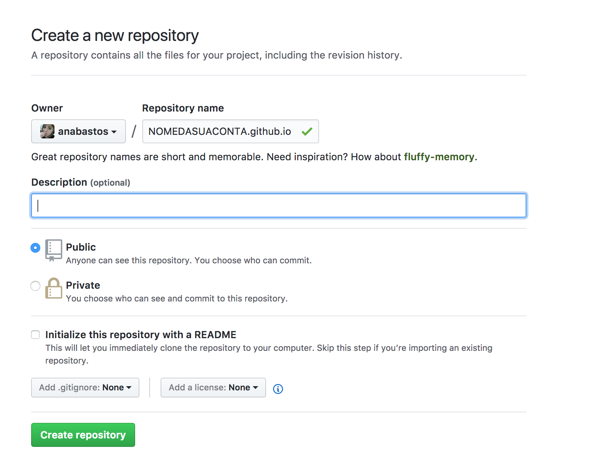
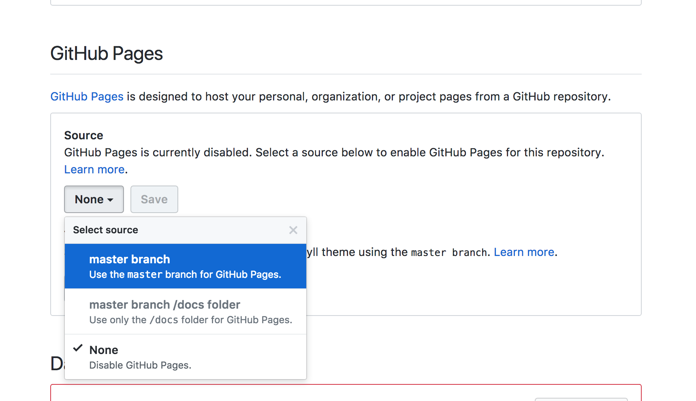
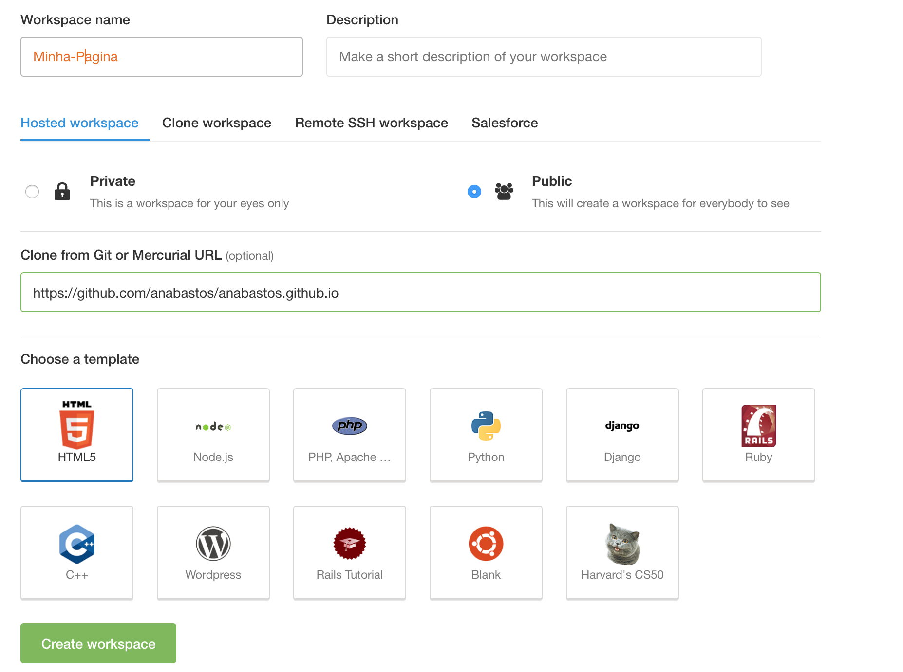
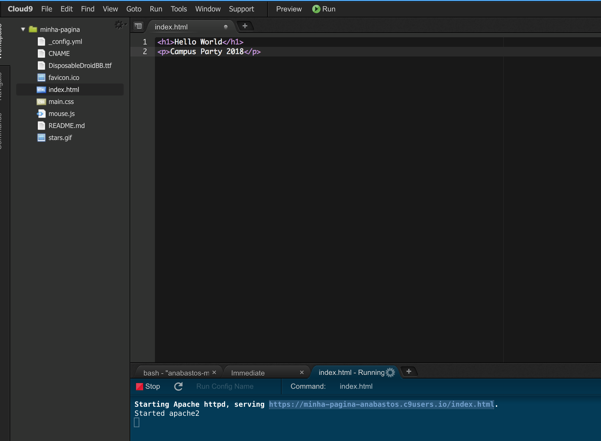

## Passo 1

#### Indice
* [Desenvolvimento Web](#desenvolvimento-web)
* [Ambiente no C9](#ambiente-no-c9)
* [Conta no github](#conta-no-github)
* [Comandos comuns do git](#comandos-comuns-do-git)


## Desenvolvimento Web

Web developers constroem e mantem sites na web
Portanto trabalham para ajudar clientes que querem um produto ou serviço na web

O trabalho de um desenvolvedor web é focado em projetos e envolve colaborar com um time que se ajuda a coordenar as necessidades do produto. 
Esse trabalho pode envolver a parte de front-end, back-end e full-stack.
Nesse workshop vamos aprender o básico de linguagens front end. Ao digitarmos um endereço no navegador, ele recebe pelo menos o arquivo HTML do web server que vai renderizar o conteúdo. Esse arquivo vai pedir para o navegador verificar também os arquivos CSS e Javascript. Cada uma dessas linguagens tem uma função diferente no nosso site e juntos determinam como vai ser estruturado(Por meio HTML), como vai ser visualizado(CSS) e como ele vai funcionar(Javascript).

É um trabalho que é legal se você gosta de resolver problemas, construir coisas uteis
e experimentar novas tecnologias. Além disso está em altissima demanda :smile:
A melhor caracterista que você pode ter como estudante é desejo por construir e persistência. 

* [The odin project](https://www.theodinproject.com/courses/web-development-101)

#### Ferramentas do dia a dia

* Computador
* Google
* Editor de texto
* Terminal
* Stackoverflow
* Git / Github

#### O que vamos criar

Colocar no ar uma pagina pessoal responsiva que pode servir como:
* Curriculo pessoal.
* Portfolio de trabalho.
* Meio de redirecionar pessoas pra suas redes sociais.

## Conta no Github

Git é um sistema de controle de versionamento de projetos e é uma ferramenta essencial para desenvolvedores. Com ele podemos criar versões de um arquivo com cada modificação salvando todas as diferenças entre os arquivos e pastas e ainda mantendo um historico de tudo que foi modificado em cada versão.
O git permite que você revise e escale seu projeto sem precisar ficar restaurando estado de arquivo passados além de ajudar muito quando estamos trabalhando em grupo. Se conectado em na internet, você pode dar colocar seu projeto no Github, que é um site que serve para compartilhar e colaborar código de outros desenvolvedores.
Enquanto git funciona na sua maquina local, Github é como se fosse um repositório remoto na web para todos os projetos de código. Dessa forma, aprendendo Git fica muita mais facil mostrar seu portfolio pelo github e é uma habilidade essencial para o desenvolvedor moderno :)

Primeiramente crie uma conta no Github aqui: [https://github.com/join](https://github.com/join).

Crie um repositório pelo [https://github.com/new](https://github.com/new)
NOMEDASUACONTA.github.io



Copie o link do seu repositório(Algo como `https://github.com/NOMEDASUACONTA/NOMEDASUACONTA.github.io`). Ele vai ser usado mais tarde para você criar seu ambiente de desenvolvimento.

Clique em configurações do seu repositório e na parte chamada "Github Pages"
Selecione para a branch "master", assim todas as modificações que forem feitas no seu projeto vão ser publicadas na url do nome do seu repositório(NOMEDASUACONTA.github.io).



Se você receber uma mensagem de `"Your site is ready to be published at http://NOMEDASUACONTA.github.io/."`
é porque tudo está ok.

## Ambiente no C9

Se logue pelo icone do github no [Cloud9](https://c9.io/).

Clique em "Create Workspace"
Dessa forma o Cloud9 vai criar um ambiente de desenvolvimento online para você :)
Preencha o form com o nome da workspace: "Minha Página"
E na opção "Clone from Git or Mercurial URL (optional)" Coloque o link do repositório que você criou



Se reclamar de não ter email registrado vá para o ["dashboard"](https://codeanywhere.com/dashboard) e clique em **Resend Verification Email**. Nesse caso você precisa verificar seu email cadastrado no github 

Clique em **"File/New File"**, uma nova aba vai abrir no editor.
Tecle **Crtl + S** ou então clique em **"File/Save as..."** e mude o Filename para **index.html** e clique no botão verde de **Save**.

Com o index.html aberto escreva nas linhas:
```html
<h1>Hello World</h1>
<p>Campus Party 2018</p>
```

Clique no botão verde de **Run**. Logo abaixo no terminal vai aparecer um link.
Ao entrar nesse link você pode ver o resultado do seu HTML.



Mas suas modificações ainda não estão no ar no [https://NOMEDASUACONTA.github.io](https://NOMEDASUACONTA.github.io) pois ainda precisamos publica-las!
No próximo cápitulo vamos abordar mais sobre HTML e faremos nosso primeiro commit no git, que vai publicar nossas moficações na web.

#### [Ir para o passo 2](chapter2.md)