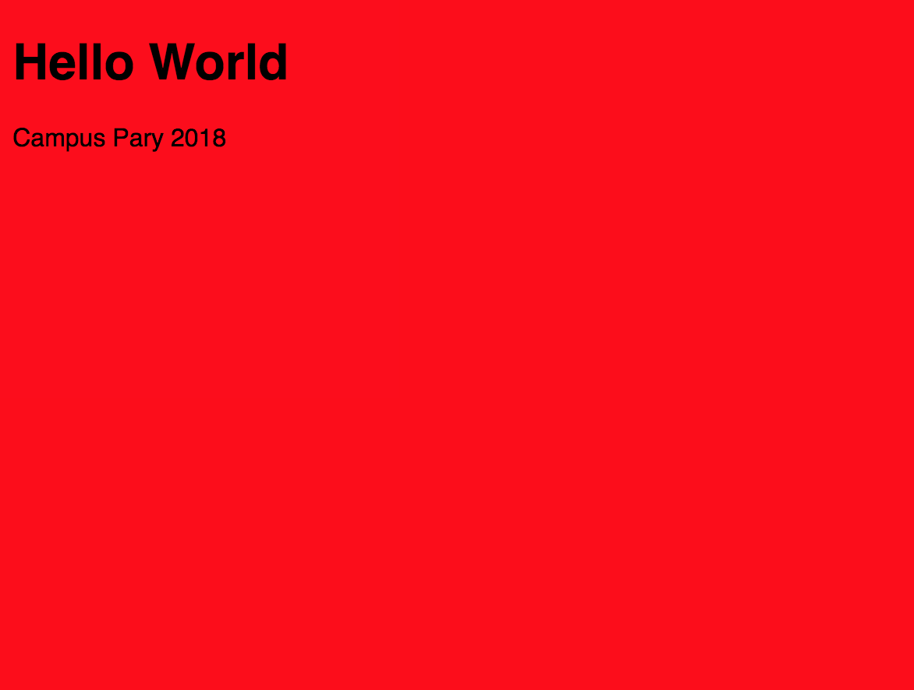

## Passo 3

#### Indice
- [O que é CSS](#o-que-e-css)
- [Estilizando o HTML](#estilizando-o-html)
- [Seu segundo commit](#seu-segundo-commit)

## Estilizando com CSS

## O que e CSS

blablablala explicar melhor
CSS contra pro browser de que forma você quer mostrar as tags html, mudando sua aparencia, posição, etc. 

https://i.ytimg.com/vi/EZ7la-hMNuk/maxresdefault.jpg

https://developer.mozilla.org/pt-BR/docs/Aprender/Getting_started_with_the_web/CSS_basico

#### [Guia CSS](guide.md)

## Estilizando o HTML

Clique em **"File/New File"**, uma nova aba vai abrir no editor.
Tecle **Crtl + S** ou então clique em **"File/Save as..."** e mude o Filename para **main.css** e clique no botão verde de **Save**.

No main.css cole:
```css
body {
    background-color: red;
    font-family: "Gill Sans Extrabold", sans-serif;
}
```

O que isso quer dizer? Tudo dentro do nosso body fica com cor de background vermelho. O background pode ser uma cor em ingles, uma cor em hexadecimal e até uma imagem.
E a fonte de tudo dentro do body vai ser a definida pelo css.

Agora, é necessário importar esse arquivo CSS dentro do nosso HTML para que os estilos funcionem.
Pra isso, dentro do `<head>` cole esta linha `<link rel="stylesheet" type="text/css" href="main.css">`

```html
<head>
    <title>Minha Pagina</title>
       <link rel="stylesheet" type="text/css" href="main.css">
</head>
```

Clique no botão verde de **Run**. Logo abaixo no terminal e ao entrar no link verifique se o fundo está de fato vermelho.



### Mais CSS

##### Fontes e Cores
Cores podem ser em hexadecimal os nomes defaults do CSS.

[img nomes default]

Você pode selecionar sua cor em hexadecinal aqui.

```css
body {
  background-color: #FFFFF 
}
```

Podemos modificar também as caracteristicas de um texto.

```css
p {
  font-size: 20px;
  font-color: darkgray;
  font-family: Arial;
  font-style: bold;
}
```


##### Selecionando elementos HTML

Para selecionar podemos usar ou a propria tag html ou criar uma propriedade `class`.
Assim podemos nomear o que o conteúdo é e pela propria nomemclatura de `class` estiliza-lo

HTML:
```html
<p class="titulo"></p>

```

```css
.titulo {
  font-size: 30px;
}
.logo {
  width: 300px;
}
```

No exemplo, criamos as classes "titulo" pra uma tag `<p>` e "logo" para uma imagem. Isso possibilita que possamos estilizar esse elemento especifico. Todo elemento que tiver classe titulo terá tamanho de fonte 30px, e todo elemento que tiver classe logo terá tamanho de 300px.

No css colocamos um ponto e o nome da classe para definir os estilos da classe.

É importante usar classes pois podemos também reutilizar estilos e definir o que cada coisa é.

Lembrando que cada elemento pode ter mais de uma classe.

Elementos também podem ser selecionados por id.

##### Background
background color background img
##### Tamanho
.box {
  width: 300px;
  height: 500px;
}

500px de altura e 300px de largura.

##### Bordas

##### Deixando redondo
Para arredondar objetos usa-se a propriedade border radius

.avatar{
  border-radius: 50%;
}

A medida é em porcentagem de arredondamento e 50% equivale a um circulo.

##### Posicionamento
left right float

## Seu segundo commit

Repita o mesmo procedimento anterior:
```bash
# Verifique status do repositório
git status
# Adiciona todos os arquivos modificados p/ staging
git add *
# Ou individualmente
git add main.css
git add index.html
# Faz commit
git commit -m "Adicionando estilos"
# Adiciona modificações
git push
```

Escrever o que foi desenvolvido para cada commit é muito importante pois ajuda pode te guiar e também ajudar ao grupo de pessosas trabalhando no mesmo projeto ao verificar o que foi desenvolvido em cada passo do projeto.

#### [Ir para o conteúdos de estudo](final.md)
