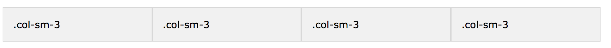
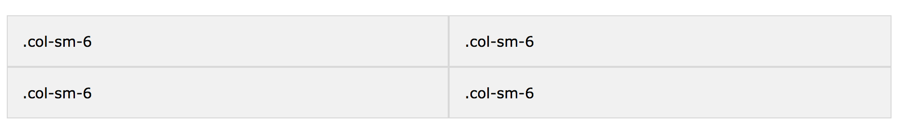

## Passo 4

#### Indice
* [Importando Boostrap](#importanto-bootstrap)
* [Importando fontawesome](#importanto-fontawesome)
* [Terceiro commit](#seu-primeiro-commit)

## Importando Bootstrap

#### Bootstrap

Bootstrap é a biblioteca mais popular de HTML, CSS e JS para o desenvolvimento de sites responsivos e é completamente gratis.

Para importar basta entrar na [página de downloads do bootstrap](https://getbootstrap.com/docs/4.0/getting-started/download/) e copiar o conteúdo do **BootstrapCDN** e colar dentro do `<HEAD>` do seu html.
Nessa pagina vamos usar a versão 4 do bootstrap.

Podemos também baixar o Bootstrap no nosso projeto e importa-lo no nosso HTML especificando o caminho dele assim como fizemos no style.css. É um padrão sempre importar arquivos externos ou internos dentro do nosso `<head>`.

#### Adicionando componentes

https://getbootstrap.com/docs/4.0/components/alerts/
blabalbla

#### Sistema de grids

Bootstrap nos permite um sistemas de grids em que podemos alinhar conteúdo em colunas.
Por exemplo, coloque este código no body do seu HTML:
```html
<div class="container">
  <div class="row">
    <div class="col-sm">
      Primeira Coluna
    </div>
    <div class="col-sm">
      Segunda Coluna
    </div>
    <div class="col-sm">
      Terceira Coluna
    </div>
  </div>
</div>
```

Para uma página pessoal é legal sempre linkar com suas redes sociais então vamos tentar fazer um grid resposivo de links.

## Importando FontAwesome

FontAwesome é um Toolkit para usar icones escalaveis e customizaveis.
Ao invés de links não podemos usar os respectivos icones da rede social usando font awesome.

Entre ["Get Started" do FontAwesome 4](http://fontawesome.io/get-started/). Nele você precisa colocar o seu email para receber o link que será colocado no `<head>`.

#### Icones em colunas 

Após importar ao colocarmos esta linha de código já temos o icone do facebook.
```html
<i class="fa fa-facebook-official" aria-hidden="true"></i>
```

Podemos aumentar ou diminuir o icone de tamanho adicinando mais classes:
```html
<i class="fa fa-facebook-official fa-2x" aria-hidden="true"></i>
```

Podemos também colocar icones em listas, rotaciona-los e até anima-los de acordo com os [exemplos do fontawesome.](http://fontawesome.io/examples/).

Para tornar esse icone linkavel basta coloca-lo dentro do `<link>`:
```html
<a href="https://www.facebook.com/anabastos8" target="_blank"><i class="fa fa-facebook-official" aria-hidden="true"></i></a>
```

#### Icones responsivos
Para tornar icones do font awesome responsivos com bootstrap vamos misturar o sistemas de grids com os icones linkaveis. Para isso vamos colocar os icones como conteúdo das colunas:

```html
<div class="container">
    <div class="row">
      <div class="col-xs-6 col-md-3">
        <a href="https://www.facebook.com/anabastos8" target="_blank"><i class="fa fa-facebook-official fa-3x" aria-hidden="true"></i></a>
      </div>
      <div class="col-xs-6 col-md-3">
          <a href="https://www.facebook.com/anabastos8" target="_blank"><i class="fa fa-google fa-3x" aria-hidden="true"></i></a>
      </div>
      <div class="col-xs-6 col-md-3">
        <a href="https://www.facebook.com/anabastos8" target="_blank"><i class="fa fa-twitter fa-3x" aria-hidden="true"></i></a>
      </div>
      <div class="col-xs-6 col-md-3">
        <a href="https://www.facebook.com/anabastos8" target="_blank"><i class="fa fa-github fa-3x" aria-hidden="true"></i></a>
      </div>
    </div>
  </div>
```

O `col-sm` significa quanto de espaçamento do grid esse elemento vai ter quando estiver em telas desktop, se ele vai ter um espaçamento de 3, conseguindo ter espaço para ficar alinhados já que o grid total é 12. O alinhamento da coluna ficará assim:



Enquanto o `col-xs` funciona quando estiver em telas mobile. Portanto os 4 icones vao ter um espaçamento como nas imagens do dobro do tamanho, por ter 6 de espaçamento quebramos os icones em duas colunas, sendo mais visual em telas mobile



Usamos `fa-3x` pois é uma classe dentro do *fontawesome* que aumenta o tamanho do icone.
Para alterar a cor do icone basta selecionar a propria classe *fontawesome* do icone.

```css
.fa {
    color: gray
}
```

Assim temos o seguinte resultado(Primeira imagem para desktop e segunda para mobile):


## Terceiro Commit

Você pode usar o comando Git Log para verificar os seus commits até agora.
```bash
# Logs
git log
```

Faça novamente os seguintes passos:
```bash
# Verifique status do repositório.
git status
# Adicione arquivos p/ staging
git add *
# Faz commit
git commit -m "Importando Bootstrap e FontAwesome"
# Adiciona modificações
git push
```

Agora se você acessar o link [https://NOMEDASUACONTA.github.io](https://NOMEDASUACONTA.github.io) verá o conteúdo do seu site
Demora algns minutos para as mudanças realmente irem ao ar mas em pouco será posivel ver suas modificações no ar.

#### [Ir para o conteúdos de estudo](final.md)
